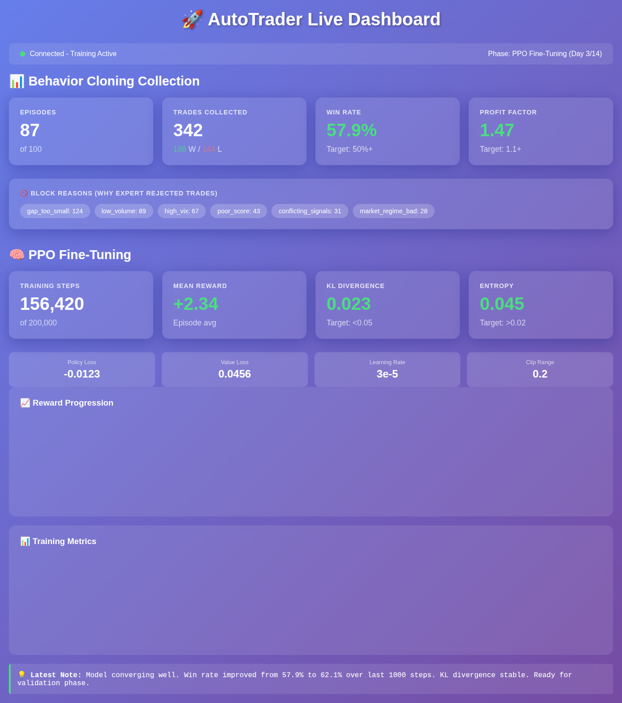

# AutoTrader Documentation

[](https://github.com/CrisisCore-Systems/Autotrader/actions/workflows/ci.yml)
[](https://github.com/CrisisCore-Systems/Autotrader/actions/workflows/security-scan.yml)
[](https://codecov.io/gh/CrisisCore-Systems/Autotrader)
[](https://github.com/codespaces/new?hide_repo_select=true&ref=main&repo=CrisisCore-Systems/Autotrader)
[](https://gitpod.io/#https://github.com/CrisisCore-Systems/Autotrader)

## 🎨 Live Training Dashboard



*Real-time visualization of Behavior Cloning collection and PPO fine-tuning progress with comprehensive training metrics.*

> **🪶 NEW: [Lightweight Development Guide](docs/LIGHTWEIGHT_DEVELOPMENT.md)** - Don't let Docker slow you down! Develop on resource-constrained laptops, use GitHub Codespaces, or skip Docker entirely. **90% less RAM usage!**

> **📖 [Understanding What You've Created](docs/OVERVIEW_INDEX.md)** - Start here for a comprehensive system overview!
> - [Quick Summary (5 min)](docs/status/SYSTEM_SUMMARY.md) - TL;DR with key stats
> - [Complete Overview (20 min)](docs/WHAT_YOU_CREATED.md) - Deep dive into the system
> - [Visual Diagrams (10 min)](docs/SYSTEM_DIAGRAMS.md) - Architecture visualizations

## CrisisCore AutoTrader - Hidden-Gem Scanner


The documentation set has moved under [`docs/`](docs/), with legacy quick-reference files now archived in [`docs/legacy/`](docs/legacy/README.md).**🆓 Now 100% FREE** - Zero API keys required with FREE data sources!


- Project overview: [`docs/overview/PROJECT_OVERVIEW.md`](docs/overview/PROJECT_OVERVIEW.md)

This repository contains the foundational blueprint and implementation for **CrisisCore AutoTrader**, a Hidden-Gem Scanner that fuses on-chain telemetry, narrative intelligence, technical analysis, and safety gating into actionable trade intelligence and ritualized "Collapse Artifact" outputs.

- Detailed guides and runbooks: see the categorized directories inside [`docs/`](docs/).

> **Disclaimer:** All outputs are informational only and **not financial advice**. Always retain a human-in-the-loop for execution decisions.

> This lightweight README keeps the repository browsable on GitHub while the full documentation lives in the structured `docs/` tree.

## 📊 **NEW: Comprehensive Repository Analysis Available**

🎯 **Complete Tree of Thought Analysis** of what this repository is, what it can do, and how far along it is:
- **[ANALYSIS_INDEX.md](docs/ANALYSIS_INDEX.md)** - Start here for navigation and quick summary
- **[REPOSITORY_ANALYSIS.md](docs/REPOSITORY_ANALYSIS.md)** - Deep dive into capabilities and maturity as an internal alpha / paper-trading beta candidate
- **[MATURITY_ASSESSMENT.md](docs/MATURITY_ASSESSMENT.md)** - Visual maturity scoring across all components (Level 3.8/5.0)
- **[STRATEGIC_ROADMAP.md](docs/STRATEGIC_ROADMAP.md)** - 12-month strategic plan with quarterly milestones

**Current launch label**: internal alpha / paper-trading beta candidate.

The repository includes substantial trading infrastructure, but the current validation state does not support a production or live-money readiness claim.

---

## 🎯 Current Status (October 26, 2025)

### Launch Readiness

| Launch lane | Status | Notes |
|-------------|--------|-------|
| Local developer demo | ✅ Launchable | Package structure, scripts, docs, and dashboards are present. |
| Solo operator paper-trading beta | ⚠️ Conditionally launchable | Requires smoke testing, clean CI, and completion of paper-trade validation. |
| Public beta / multi-user MVP | ❌ Not ready | Product services and validation remain incomplete. |
| Live-money auto-trading | ❌ Not ready | Validation and security gates are not yet strong enough for financial automation. |

### ✅ **Phase 3 — Data Preparation (50% Complete)**

**Bar Construction Library**:
- ✅ **6 Bar Algorithms**: Time, Tick, Volume, Dollar, Imbalance, Run bars
- ✅ **Data Cleaning**: TimezoneNormalizer, SessionFilter, DataQualityChecker
- ✅ **Unified API**: BarFactory interface for all bar types
- ✅ **Quality**: 0 Codacy issues, 100% test coverage on real data
- ✅ **Performance**: <40ms for 3,002 ticks (all bar types)
- ✅ **Documentation**: 220+ pages (specs, guides, comparisons)
- ⏳ **Next**: Week 3 - Order Book Features (15+ L2 features)

**Key Documents**:
- [`PHASE_3_MIDPOINT_SUMMARY.md`](docs/phases/PHASE_3_MIDPOINT_SUMMARY.md) - Executive summary (Weeks 1-2)
- [`PHASE_3_WEEK_2_COMPLETE.md`](docs/phases/PHASE_3_WEEK_2_COMPLETE.md) - Bar construction details
- [`PHASE_3_DATA_PREP_SPECIFICATION.md`](docs/phases/PHASE_3_DATA_PREP_SPECIFICATION.md) - Full specification

### ⚠️ **Paper-Trading Beta Candidate**

**BounceHunter/PennyHunter Gap Trading Strategy**:
- ✅ **Broker Integration**: Multi-broker support (Paper, Alpaca, Questrade, IBKR)
- ✅ **Comprehensive Test Suite**: 86 test files, 188 source files
  - `test_broker.py`: Complete broker abstraction tests
  - `test_bouncehunter_engine.py`: Gap trading strategy validation
  - `test_agentic.py`: Multi-agent orchestration tests
  - `test_backtest.py`: Backtesting framework validation
- ⚠️ **Phase 2 Validation**: IN PROGRESS (2/20 trades accumulated; not enough evidence for live deployment)
- ✅ **Market Regime Detection**: SPY/VIX monitoring with adaptive sizing
- ✅ **Advanced Risk Filters**: 5 modules (liquidity, slippage, runway, sector, volume)
- ✅ **Paper Trading Workflow**: Daily automation scripts ready
- ✅ **Documentation**: 25+ guides (operator manuals, setup, API references)

**Infrastructure**:
- ✅ Database migrations system (Alembic with schema versioning)
- ✅ Security controls implemented (dependency scanning, FA field scrubbing for IBKR, secret scanning)
- ✅ Canadian broker support (Questrade with auto-refreshing tokens)
- ✅ Git workflow established (staged → committed → pushed to GitHub)

**Current blockers before a broader launch**:
- Complete Phase 2 paper-trading validation with a meaningful trade sample.
- Keep the repository on officially supported Python versions only.
- Keep dependency and filesystem scans green; treat CI security artifacts as the source of truth instead of committed local scan snapshots.
- Limit current release positioning to paper trading until validation is complete.

### 📚 **Documentation Hub**

**Trading System**:
- **Getting Started**: [`docs/PENNYHUNTER_GUIDE.md`](docs/PENNYHUNTER_GUIDE.md) - Complete PennyHunter guide
- **Operator Manual**: [`docs/OPERATOR_GUIDE.md`](docs/OPERATOR_GUIDE.md) - Daily operations
- **Broker Setup**: 
  - [`QUESTRADE_SETUP.md`](docs/legacy/QUESTRADE_SETUP.md) - Canadian broker integration
  - [`IBKR_SETUP_README.md`](docs/legacy/IBKR_SETUP_README.md) - Interactive Brokers setup
  - [`docs/BROKER_INTEGRATION.md`](docs/BROKER_INTEGRATION.md) - Multi-broker architecture
- **Phase 2 Status**: [`PHASE2_VALIDATION_PLAN.md`](docs/legacy/PHASE2_VALIDATION_PLAN.md) - Current validation progress
- **Quick Start**: [`QUESTRADE_QUICKSTART.md`](docs/legacy/QUESTRADE_QUICKSTART.md) - 5-minute setup

**Architecture & Design**:
- **System Architecture**: [`ARCHITECTURE.md`](docs/ARCHITECTURE.md) - Complete system architecture, modules, and data flows
- **Feature Catalog**: [`FEATURE_CATALOG.md`](docs/FEATURE_CATALOG.md) - Complete feature inventory and data contracts
- **Agentic System**: [`docs/AGENTIC_ARCHITECTURE.md`](docs/AGENTIC_ARCHITECTURE.md) - Multi-agent design
- **Roadmap**: [`AGENTIC_ROADMAP_QUICK_REF.md`](docs/legacy/AGENTIC_ROADMAP_QUICK_REF.md) - Implementation phases
- **Backtesting**: [`docs/PHASE_3_BACKTEST_RESULTS.md`](docs/PHASE_3_BACKTEST_RESULTS.md) - Strategy validation

**Legacy Documentation** (Hidden-Gem Scanner):
- **Project Overview**: [`docs/overview/PROJECT_OVERVIEW.md`](docs/overview/PROJECT_OVERVIEW.md)
- **Quick Reference**: [`NEXT_SESSION_GUIDE.md`](docs/legacy/NEXT_SESSION_GUIDE.md)
- **Navigation**: [`DOCUMENTATION_INDEX.md`](DOCUMENTATION_INDEX.md)

### 💰 **Cost Savings**
| Tier | Monthly Cost | API Keys | Status |
|------|--------------|----------|--------|
| **FREE (Recommended)** | **$0** | **0** | ✅ **Ready** |
| Paid (Optional) | ~$50 | 3 | ✅ Supported |

### 🚀 **Recent Updates (October 2025)**

**BounceHunter/PennyHunter Trading System**:
- **🎉 Major Implementation**: Complete broker integration with 4 brokers (Paper, Alpaca, Questrade, IBKR)
- **📊 Comprehensive Testing**: 86 test files covering all major components
  - Complete broker abstraction tests
  - Gap trading engine validation
  - Multi-agent orchestration framework
  - Backtesting system with metrics
- **🤖 Agentic Architecture**: 8-agent system design (Sentinel, Screener, Forecaster, RiskOfficer, NewsSentry, Trader, Historian, Auditor)
- **📈 Phase 2 Validation**: Active paper trading (2/20 trades accumulated)
- **�️ Advanced Risk Management**: 5-module filter system
  - Dynamic liquidity delta monitoring
  - Effective slippage estimation
  - Cash runway validation
  - Sector diversification enforcement
  - Volume fade detection
- **� Daily Automation**: Scripts for scanning, analysis, and journal creation
- **🍁 Canadian Integration**: Questrade with auto-refreshing tokens, IBKR Canada setup
- **📚 Documentation**: 25+ comprehensive guides for operators and developers
- **🔐 Security**: FA field scrubbing for IBKR, updated dependencies, secure credential management

**Previous Updates (October 2025)**:
- **🔒 Security**: Critical pymongo vulnerability fixed
- **� Branding**: 100% AutoTrader consistency
- **🗄️ Database**: Alembic migrations system
- **🛡️ API Protection**: Rate limiting (10-120/min)

**See [`BROKER_INTEGRATION_COMPLETE.md`](docs/legacy/BROKER_INTEGRATION_COMPLETE.md) and [`PHASE2_VALIDATION_PLAN.md`](docs/legacy/PHASE2_VALIDATION_PLAN.md) for complete details**

## System Overview

The system ingests multi-modal crypto intelligence, transforms it into hybrid feature vectors, scores each asset with the `GemScore` ensemble, and renders both operational dashboards and Collapse Artifacts for archival lore. The architecture keeps safety as a hard gate while providing a tunable scoring surface for discovery experiments.

### High-Level Architecture

```mermaid
flowchart TD
    subgraph Ingestion ["🆓 FREE Data Sources (NEW)"]
        A1[CoinGecko\n(Price - FREE)]
        A2[Dexscreener\n(Liquidity - FREE)]
        A3[Blockscout\n(Contracts - FREE)]
        A4[Ethereum RPC\n(On-chain - FREE)]
        A5[Groq AI\n(Narratives - FREE)]
    end

    subgraph "Paid Sources (Optional)"
        P1[Etherscan\n(Contracts - Paid)]
        P2[DeFiLlama\n(Liquidity - Paid)]
    end

    subgraph Processing
        B1[Feature Extractors\n(Time-Series, Tokenomics, Narrative)]
        B2[Vector Store\n(Embeddings)]
        B3[Risk Filters\n(Static + Heuristics)]
        B4[GemScore Ensemble]
    end

    subgraph Delivery
        C1[FastAPI Service]
        C2[Next.js Dashboard]
        C3[Alerts\n(Telegram, Slack)]
        C4[Collapse Artifacts\n(Obsidian Export)]
    end

    A1 & A2 & A3 & A4 & A5 --> B1
    P1 & P2 -.-> B1
    B1 --> B2
    B1 --> B3
    B3 --> B4
    B2 --> B4
    B4 --> C1
    C1 --> C2
    C1 --> C3
    C1 --> C4
```

## 🚀 Quick Start - BounceHunter Gap Trading

> **Environment requirement:** Use Python 3.11, 3.12, or 3.13. CI covers the supported runtime contract, with 3.11 kept as the baseline environment for several auxiliary workflows.

> **⚡ Laptop struggling with Docker?** See [Lightweight Development Guide](LIGHTWEIGHT_DEVELOPMENT.md) for alternatives that use **90% less RAM**! Includes GitHub Codespaces, SQLite-only mode, and more.

### Option 1: Lightweight Development (🪶 Recommended for Limited Resources)

**No Docker required!** Perfect for laptops with limited RAM or slow performance.

```bash
# Quick setup (5 minutes)
python setup_lightweight.py

# Or manual setup:
cp .env.lightweight .env
pip install -r requirements.txt
python scripts/db/init_dev_databases.py

# Start developing!
python run_scanner_free.py
uvicorn src.api.main:app --reload
```

**Memory usage:** 200-500 MB (vs 4-8 GB with Docker)

**What works:** All core trading features, paper trading, backtesting, testing, and development tools.

**What's disabled:** Optional infrastructure (Kafka, Redis, Grafana, Prometheus). These are production features you don't need for development!

**See full guide:** [LIGHTWEIGHT_DEVELOPMENT.md](LIGHTWEIGHT_DEVELOPMENT.md)

### Option 2: GitHub Codespaces (☁️ Zero Local Resources)

Develop entirely in the cloud - no impact on your laptop!

1. Click the green `Code` button → `Codespaces` → `Create codespace`
2. Wait 2-3 minutes for setup
3. Start coding! (60 hours/month free)

### Option 3: Containerized Development Environment (Full Stack)

```bash
cp .env.example .env
make bootstrap
docker compose up -d
```

- API available at [http://localhost:8000](http://localhost:8000)
- MLflow tracking UI at [http://localhost:5000](http://localhost:5000)
- Prefect server UI at [http://localhost:4200](http://localhost:4200)
- Prometheus at [http://localhost:9090](http://localhost:9090) and Grafana at [http://localhost:3000](http://localhost:3000) (default `admin/admin`)

Useful helpers:

- `make compose-logs` to follow service logs
- `make compose-down` to tear down the stack when finished
- `dvc repro train_model` to execute the data → training pipeline locally

To orchestrate the full experiment pipeline via Prefect:

```bash
prefect deployment build orchestration/flows/experiment_pipeline.py:experiment_flow -n local-dev
prefect deployment run "autotrader-experiment-pipeline/local-dev"
```

### Installation

```bash
# Clone the repository
git clone https://github.com/CrisisCore-Systems/Autotrader.git
cd Autotrader/Autotrader

# Create virtual environment
python -m venv .venv-1
.venv-1\Scripts\activate  # On Windows PowerShell

# Install dependencies (or run `make bootstrap`)
pip install -r requirements.txt

# Initialize DVC (first-time only)
dvc init
dvc repro train_model

# Initialize development databases
python scripts/db/init_dev_databases.py
```

**Database Setup**: The system uses SQLite databases for agent memory and experiment tracking. These databases are NOT committed to version control and must be initialized locally:

- **bouncehunter_memory.db**: Agent memory for trading signals and outcomes
- **test_memory.db**: Test database with same structure
- **experiments.sqlite**: Experiment configuration tracking

Run `python scripts/db/init_dev_databases.py` to create empty databases with the correct schema. Database migrations are managed via Alembic in the `migrations/` directory.

### Set Up Broker Credentials

**For Paper Trading (Recommended)**:
```yaml
# Create configs/broker_credentials.yaml
paper:
  enabled: true
  initial_capital: 100000.0
```

**For Questrade (Canadian)**:
```yaml
# Add to configs/broker_credentials.yaml
questrade:
  enabled: true
  refresh_token: "YOUR_REFRESH_TOKEN_HERE"
  practice_account: true  # Use practice account first!
```

See [`QUESTRADE_SETUP.md`](docs/legacy/QUESTRADE_SETUP.md) for detailed setup instructions.

### Run Phase 2 Validation

**Daily Paper Trading**:
```bash
# Activate virtual environment
.venv-1\Scripts\activate

# Run daily scan and paper trading
python scripts\daily_pennyhunter.py

# Analyze results
python scripts\analyze_pennyhunter_results.py
```

**Expected Output**:
```
=================================================================
 PENNYHUNTER DAILY RUNNER
=================================================================
Date: 2025-10-26

📊 Current Progress: 2/20 trades (10%)
✅ Win Rate: 100.0% (Target: 65-75%)
📈 Phase 2 validation in progress...

Running scan...
✅ 1 signal passed quality gates
🔄 Paper trading executed

📁 Results saved to: reports/pennyhunter_cumulative_history.json
```

### Core Trading Workflow

```python
from src.bouncehunter.broker import create_broker
from src.bouncehunter.market_regime import MarketRegimeDetector
from src.bouncehunter.pennyhunter_scanner import GapScanner

# Initialize components
broker = create_broker("paper", initial_cash=100000.0)
regime = MarketRegimeDetector()
scanner = GapScanner()

# Check market regime
current_regime = regime.get_regime()
if not current_regime.allow_penny_trading:
    print("❌ Market regime unfavorable - no trading today")
    exit(0)

# Scan for gap opportunities
tickers = ["INTR", "ADT", "SAN", "COMP", "CLOV", "EVGO"]
signals = scanner.scan(tickers)

# Execute paper trades
for signal in signals:
    if signal['score'] >= 5.5:  # Quality gate
        broker.place_bracket_order(
            ticker=signal['ticker'],
            quantity=100,
            entry_price=signal['entry'],
            stop_price=signal['stop'],
            target_price=signal['target']
        )
        print(f"✅ Paper trade: {signal['ticker']} @ ${signal['entry']}")
```

### Test the System

```bash
# Run core module tests (features, scoring, reliability)
pytest tests/test_features.py tests/test_scoring.py tests/test_reliability_services.py -v

# Run broker tests
pytest tests/test_broker.py -v

# Run gap trading engine tests
pytest tests/test_bouncehunter_engine.py -v

# Run comprehensive test suite
pytest tests/test_broker.py tests/test_bouncehunter_engine.py tests/test_agentic.py -v

# Run with coverage report
pytest --cov=src --cov-report=term --cov-report=html
```

**📊 Testing & CI Documentation**:
- **Test Coverage Summary**: [`docs/TESTING_SUMMARY.md`](docs/TESTING_SUMMARY.md) - 36 core module tests
- **CI Gating Setup**: [`docs/CI_GATING_SETUP.md`](docs/CI_GATING_SETUP.md) - Branch protection and quality gates

The repository enforces quality gates via GitHub Actions with 80% coverage target, automatic linting, and type checking on all PRs.

### Tree-of-Thought Execution Trace

Every scan executes the hardened Tree-of-Thought plan described in the strategy memo. Each branch in the tree is materialized as
an executable node that records its own outcome, summary, and data payload, and the trace explicitly tags deferred/pruned workstreams (wallet clustering, social ingestion, fuzzing, alert fan-out) as `skipped` for roadmap visibility. Inspect the trace directly from the CLI:

```bash
python -m src.cli.run_scanner configs/example.yaml --tree --tree-format pretty
```

Switch to `--tree-format json` to export a machine-readable structure for Collapse Artifact enrichment or downstream tooling.

### Component Breakdown

| Layer | Responsibilities | Key Tech | Cost |
|-------|------------------|----------|------|
| Ingestion | Pull structured price, on-chain, contract, and narrative datasets. | CoinGecko (FREE), Dexscreener (FREE), Blockscout (FREE), Ethereum RPC (FREE) | **$0/mo** |
| Feature Extraction | Compute time-series indicators, tokenomics ratios, narrative embeddings, and risk flags. | `pandas`, `numpy`, `ta`, Groq AI (FREE) | **$0/mo** |
| Analysis & Scoring | Aggregate features into `GemScore` with confidence bands. | Custom Python module, `scikit-learn`, `HDBSCAN` | **$0/mo** |
| Safety | Static analysis, heuristics, liquidity checks. | `slither`, bespoke rules engine | **$0/mo** |
| Delivery | API, dashboard, alerts, Collapse Artifacts. | FastAPI, PostgreSQL/TimescaleDB, Next.js, Telegram Bot API | **$0/mo** |

## Data & Feature Model

### Core Feature Families

1. **Sentiment & Narrative** – embedding-driven sentiment score, narrative volatility, memetic motifs.
2. **On-chain Behavior** – wallet cohort accumulation, transaction size skew, smart-money overlap.
3. **Market Microstructure** – liquidity depth, order-book spread, volatility regime.
4. **Tokenomics** – supply distribution, vesting cliffs, unlock schedule risk (heavy penalty if ≥10% supply unlocks within 30 days).
5. **Contract Safety** – verification status, privileged functions, proxy patterns, honeypot flags.

### GemScore Formula

`GemScore = Σ(wᵢ · featureᵢ)` with weights: `S=0.15`, `A=0.20`, `O=0.15`, `L=0.10`, `T=0.12`, `C=0.12`, `N=0.08`, `G=0.08`. Scores are normalized 0–100.

Confidence is computed as `0.5 · Recency + 0.5 · DataCompleteness` and reported alongside the score. Assets require **≥3 independent positive signals** and a **safety gate pass** before surfacing to operators.

## Infrastructure Blueprint

### Deployment Topology

- **Data Plane:** Batch + streaming ingestion workers (Python) deployed on Render/DO. Prefect or Celery orchestrates ETL cadences.
- **Storage:**
  - PostgreSQL/TimescaleDB for structured + time-series data.
  - Vector database (Pinecone for hosted MVP, Milvus/Weaviate for self-hosted).
  - Object storage (S3-compatible) for raw artifacts and provenance bundles.
- **Model Services:** Containerized prompt workers (LLM calls) behind FastAPI microservice with rate limiting.
- **Delivery:** FastAPI core API, Next.js dashboard on Vercel, alert bots via serverless functions or lightweight worker.

### CI/CD Skeleton

1. GitHub Actions workflows for lint/test/build (see [`.github/workflows/`](.github/workflows/)).
2. Infrastructure-as-code stubs in [`infra/`](infra/) for Terraform or Pulumi expansion.
3. Secrets stored in Vault/Secrets Manager. Local development uses `.env` managed by Doppler or `direnv`.

### Observability & Safety

**Comprehensive Observability Stack** - Operations-grade monitoring and debugging for internal alpha and paper-trading workflows:

- ✅ **Structured JSON Logging**: All components emit structured logs with context using `structlog`
  - Request correlation IDs for end-to-end tracing
  - Consistent field names for log aggregation (ELK, Loki, etc.)
  - Context binding for scoped logging (user, session, request)
  
- ✅ **Prometheus Metrics**: Comprehensive metrics for all system components
  - Scanner metrics: request rates, durations, error rates, gem scores
  - Data source metrics: API latencies, error rates, cache hit rates, circuit breaker states
  - API metrics: request counts, durations, active requests, error rates
  - Feature metrics: validation failures, value distributions, freshness
  
- ✅ **Distributed Tracing**: OpenTelemetry integration for request/response flows
  - Automatic span creation for all major operations
  - Trace ID propagation across service boundaries
  - Integration with Jaeger, Zipkin, or other OTLP-compatible backends
  
- ✅ **FastAPI Instrumentation**: Automatic API observability
  - Request/response logging with durations and status codes
  - Trace ID headers for correlation
  - Active request tracking

- ✅ **Metrics Server**: Standalone Prometheus exporter
  ```bash
  python -m src.services.metrics_server --port 9090
  # View at http://localhost:9090/metrics
  ```

- 🛡️ **Safety Alerting**: Real-time notifications for safety violations
  - Contract analyzer flags (HIGH severity contracts blocked)
  - Rate limit breaches and API failures
  - Data quality issues and validation failures

**Quick Start:**
```bash
# Run observability example
python examples/observability_example.py

# View full documentation
open docs/observability.md
```

See [`docs/observability.md`](docs/observability.md) for complete configuration and deployment guide.

### Artifact Provenance & Glossary (NEW)

**Full lineage tracking and technical documentation generation**

Track the complete lifecycle of every data artifact from ingestion through to GemScore calculation:

```python
from src.core.provenance_tracking import complete_pipeline_tracked
from src.core.provenance import get_provenance_tracker

# Run analysis with full provenance tracking
results = complete_pipeline_tracked(
    snapshot=market_snapshot,
    price_series=prices,
    narrative_embedding_score=0.75,
    contract_report=safety_report,
    data_source="etherscan"
)

# Explore lineage
tracker = get_provenance_tracker()
lineage = tracker.get_lineage(results['provenance']['score_id'])
mermaid_diagram = tracker.export_lineage_graph(score_id, format="mermaid")
```

**Key Features:**
- ✅ **Complete Lineage Tracking**: Track all data transformations and dependencies
- ✅ **Performance Metrics**: Monitor transformation duration and bottlenecks
- ✅ **Quality Assurance**: Track data quality metrics throughout pipeline
- ✅ **Visual Diagrams**: Export lineage as Mermaid diagrams for visualization
- ✅ **Technical Glossary**: Auto-generated documentation for all metrics and features
- ✅ **Search & Browse**: Full-text search and category-based browsing of terms

**Usage:**

```python
# Look up technical terms
from src.core.glossary import get_glossary

glossary = get_glossary()
term = glossary.get_term("GemScore")
print(term.definition)  # Full definition with formula and range
print(term.formula)     # Mathematical formula
print(term.range)       # Valid value range

# Search for terms
results = glossary.search("risk")

# Export documentation
glossary.export_markdown(Path("docs/GLOSSARY.md"))
```

**Documentation:**
- 📓 [Interactive Notebook](notebooks/hidden_gem_scanner.ipynb) - Hands-on tutorial
- 🔍 [Demo Script](examples/demo_provenance.py) - Provenance tracking example
- 🧪 [Test Script](scripts/manual/test_provenance_glossary.py) - Test suite

**Quick Start:**

```bash
# Run interactive demo
python examples/demo_provenance.py

# Run test suite
python scripts/manual/test_provenance_glossary.py

# Explore in Jupyter
jupyter notebook notebooks/hidden_gem_scanner.ipynb
```

## Roadmap

| Sprint | Duration | Milestones |
|--------|----------|------------|
| 0 | Week 0 | Repo scaffold, env bootstrap, secrets vaulting, foundational DB migrations. |
| 1 | Weeks 1–2 | Price + on-chain ingestion, contract verification ingest, feature extractor skeleton. |
| 2 | Weeks 3–4 | GemScore implementation, safety gate, Next.js dashboard, Collapse Artifact exporter. |
| 3 | Weeks 5+ | Wallet clustering integration, narrative embeddings, backtest harness, reinforcement learning for weight tuning. |

## Backtesting Protocol

1. Assemble 12–36 months of historical data across modalities.
2. Recompute features on rolling 24h/7d windows.
3. Emit daily GemScore rankings and evaluate:
   - `precision@K`
   - Return distributions (median/mean) over 7/30/90-day windows
   - False positive rates & drawdown analysis
   - Paper portfolio Sharpe ratio
4. Perform time-based cross-validation (e.g., expanding/rolling windows).
5. Adjust weights and filters iteratively, prioritizing safety over recall.

## Collapse Artifact Output

Artifacts blend operational data with mythic lore for archival memorywear. See [`artifacts/templates/collapse_artifact.html`](artifacts/templates/collapse_artifact.html) for the HTML/CSS zine template and [`artifacts/examples/sample_artifact.md`](artifacts/examples/sample_artifact.md) for Markdown exports. Render as PDF via `weasyprint` or Vercel serverless renderer.

## Repository Structure

```
├── README.md                     # System blueprint & operating guide
├── requirements.txt              # Python dependencies
├── requirements-py313.txt        # Python 3.13 compatible dependencies
├── pyproject.toml               # Project configuration
├── sitecustomize.py             # Ensures UTF-8 output on interpreters
├── scripts/
│   ├── api/                     # API server launchers (start_api.py, simple_api.py)
│   ├── debug/                   # Debug scripts for troubleshooting
│   ├── setup/                   # Configuration and setup utilities
│   ├── testing/                 # Manual integration and smoke tests
│   ├── troubleshooting/         # Advanced diagnostic tools
│   ├── dashboard/               # Frontend tooling
│   ├── demo/
│   │   ├── main.py              # Hidden Gem scanner demo entry point
│   │   └── main.ts              # TypeScript pipeline skeleton (Phase 1-2)
│   ├── monitoring/
│   │   └── status_check.py      # System health check script
│   ├── notebooks/
│   │   └── create_notebook.py   # Notebook repair helper
│   ├── powershell/              # Windows automation scripts
│   ├── testing/
│   │   ├── run_tests.py         # Pytest convenience runner
│   │   ├── validate_fixes.py    # Namespace/schema/notebook validator
│   │   ├── validate_system.py   # Post-installation system checks
│   │   └── verify_cli.py        # CLI verification harness
│   └── manual/                  # Interactive regression experiments
├── prompts/
│   ├── narrative_analyzer.md    # LLM prompt for narrative analysis
│   ├── onchain_activity.md      # LLM prompt for on-chain metrics
│   ├── contract_safety.md       # LLM prompt for safety analysis
│   └── technical_pattern.md     # LLM prompt for technical patterns
├── notebooks/
│   └── hidden_gem_scanner.ipynb   # Prototype ingest → score workflow
├── artifacts/
│   ├── templates/
│   │   └── collapse_artifact.html
│   └── examples/
│       └── sample_artifact.md
├── backtest/
│   └── harness.py                # Backtest harness scaffold
├── ci/
│   └── semgrep.yml              # Security scanning config
├── infra/
│   └── docker-compose.yml        # Local stack bootstrap
├── configs/
│   ├── example.yaml             # Scanner configuration template
│   ├── llm.yaml                 # LLM provider settings
│   └── alert_rules.yaml         # Alert configuration
├── docs/
│   ├── ETHERSCAN_V2_MIGRATION.md   # Etherscan API v2 migration guide
│   ├── FEATURE_STATUS.md        # Feature implementation status
│   ├── ORDERFLOW_TWITTER_IMPLEMENTATION.md  # OrderFlow & Twitter docs
│   └── RELIABILITY_IMPLEMENTATION.md  # Reliability & monitoring docs
├── tests/
│   ├── test_smoke.py            # Smoke tests
│   ├── test_free_clients_integration.py  # Integration tests
│   ├── test_features.py     # Feature tests
│   ├── test_broker.py      # Broker abstraction tests
│   ├── test_bouncehunter_engine.py  # Gap trading engine tests
│   └── ...                      # Additional test files (86 total)
└── src/
    ├── core/
    │   ├── __init__.py
    │   ├── clients.py            # HTTP data providers (CoinGecko, DefiLlama, Etherscan)
    │   ├── free_clients.py       # 🆓 FREE data providers (Blockscout, Ethereum RPC)
    │   ├── orderflow_clients.py  # 🆓 FREE DEX clients (Dexscreener)
    │   ├── features.py           # Feature engineering utilities
    │   ├── narrative.py          # Narrative sentiment + momentum estimator
    │   ├── pipeline.py           # Hidden-Gem Scanner orchestration layer
    │   ├── scoring.py            # GemScore weighting logic
    │   └── safety.py             # Contract & liquidity safety heuristics
    ├── cli/
    │   └── run_scanner.py        # CLI entrypoint to execute scans
  ├── api/
  │   ├── main.py              # Lightweight scanner API entrypoint
  │   ├── routes/
  │   │   └── tokens.py        # Token discovery endpoints
  │   ├── services/
  │   │   ├── cache.py         # In-memory cache utilities
  │   │   └── scanner.py       # Hidden Gem scanner coordination
  │   ├── schemas/
  │   │   └── token.py         # Pydantic response models
  │   ├── utils/
  │   │   └── tree.py          # Execution tree serialization helpers
  │   └── dashboard_api.py      # FastAPI dashboard endpoints
    └── services/
        └── exporter.py           # Collapse Artifact exporter
```

## Getting Started

### Prerequisites

- Python 3.11+ (tested on 3.13.7)
- Virtual environment recommended
- No API keys required for FREE tier!

### Installation

```bash
# Clone repository
git clone https://github.com/CrisisCore-Systems/Autotrader.git
cd Autotrader/Autotrader

# Create virtual environment
python -m venv .venv
source .venv/bin/activate  # Windows: .venv\Scripts\activate

# Install dependencies
pip install -r requirements.txt
# Or for Python 3.13:
pip install -r requirements-py313.txt
```

### Validation

```bash
# Run system validation
python scripts/testing/validate_system.py

# Run smoke tests
pytest tests/test_smoke.py tests/test_free_clients_integration.py -v
```

### Basic Usage (FREE Tier)

```bash
# Configure scanner
cp configs/example.yaml configs/my_scan.yaml
# Edit my_scan.yaml with your target token

# Execute scan with FREE clients
python -m src.cli.run_scanner configs/my_scan.yaml --tree

# Or start the lightweight API
uvicorn src.api.main:app --host 127.0.0.1 --port 8000
# Visit http://localhost:8000/docs for API documentation
```

### Advanced Usage (Optional Paid Tier)

If you want enhanced reliability with paid data sources:

```bash
# Set environment variables
export GROQ_API_KEY="your-key-here"
export ETHERSCAN_API_KEY="your-key-here"
export COINGECKO_API_KEY="your-key-here"

# Use enhanced API
python start_enhanced_api.py
```

## Next Steps

- ✅ **Comprehensive Test Suite**: 86 test files covering all major components
- ✅ **FREE Tier Working**: $0/month, 0 API keys required
- ✅ **Documentation Updated**: Reflects current state
- 🎯 **Future Enhancements**: 
  - Wire Next.js dashboard for UI
  - Add wallet clustering integration
  - Implement reinforcement learning for weight tuning
  - Expand backtest harness with historical data

For questions or collaboration, open an issue or reach out to the CrisisCore AutoTrader maintainers.


**Phase 1–2 Pipeline Implementation**

This repository contains the foundational skeleton for the AutoTrader Data Oracle, a sophisticated cryptocurrency analysis system that combines multi-source data ingestion, sentiment synthesis, technical intelligence, and contract security analysis.

## 🌌 Vision & Mission

### Mission in One Line

Build a reliable, safety-gated, AI-assisted system that discovers early, high-potential crypto tokens before retail hype, then translates those signals into ranked dashboards, actionable alerts, and mythic “Collapse Artifact” reports you can publish, sell, or archive as lore.

### The Problem It Solves (Bluntly)

- Noise > Signal. Thousands of tokens, shallow reporting, coordinated shilling.
- Fragmented data. On-chain, order books, GitHub, social—never in one place.
- Security blind spots. Great narratives can hide unsafe contracts and toxic tokenomics.
- Creative moat missing. Pure quant tools don’t build brand, community, or artifacts.

This project fuses quant + narrative + security into a single pipeline with a human-in-the-loop, and aestheticizes the output so it becomes both research and product.

### Concrete Objectives

1. Surface hidden gems early by ranking tokens with a multi-signal **GemScore** blending on-chain accumulation, technicals, sentiment/narrative momentum, liquidity depth, tokenomics, and contract safety.
2. Block obvious rugs/exploits via a contract safety gate that checks owner privileges, mintability, upgradeability, and exploit patterns.
3. Make the signal usable with a dashboard (ranked list + charts), alerts (Telegram/Slack), and Obsidian exports for daily operations.
4. Create monetizable artifacts: high-score tokens become “Lore Capsules” rendered as collectible reports with codex glyphs and poetic captioning.
5. Continuously learn by backtesting, measuring precision@K, and re-weighting features in a recursive improvement loop.
6. Stay human-controlled—no auto-trading, no custody; the system suggests, you decide.

### Scope (What It Will Do)

- Ingest multi-source data: price/volume, TVL, whale flows, contract metadata, tokenomics, headlines/social snippets, GitHub commits.
- Normalize then feature-ize: technical indicators (RSI/MACD/MAs), accumulation metrics, liquidity depth, unlock schedules, narrative embeddings.
- Score & rank tokens with GemScore (0–100) and a Confidence metric, gating everything through safety checks.
- Output top candidates with charts, risk notes, and “Collapse Artifact” PDFs while logging feedback for iterative improvement.

### Non-Goals (What It Won’t Do)

- Hold keys, place trades, promise returns, or provide financial advice.
- Replace diligence; it accelerates and augments it.

## 🧠 System at a Glance

**Inputs → Transforms → Outputs**

**Inputs**: On-chain (Etherscan/The Graph/DefiLlama), market data (CoinGecko/exchange APIs), social/news snippets (X, Reddit, headlines), GitHub activity, tokenomics (supply, unlocks, vesting).

**Transforms**: Feature extraction (technicals, accumulation, liquidity), narrative embeddings and clustering (NVI), contract safety analysis (privileges, proxies, mintability), ensemble scoring with time decay.

**Outputs**: Web dashboard (ranked tokens + drilldowns), alerts (score jumps, safety changes), Collapse Artifact reports (Obsidian/PDF zines), API for ecosystem reuse.

## 🧮 Core Scoring Model

Features (normalized 0–1): Sentiment/Narrative (S, NVI), Accumulation (A), On-chain activity (O), Liquidity depth (L), Tokenomics risk (T), Contract safety (C), Meme momentum (M), Community growth (G).

Example weighting (MVP): S:0.15, A:0.20, O:0.15, L:0.10, T:0.12, C:0.12, M:0.08, G:0.08 → Σ=1.0.

**GemScore** = Σ (wᵢ·featureᵢ) reported 0–100 with a separate Confidence score. A safety gate penalizes or blocks assets with severe contract flags or ultra-thin liquidity.

## 👥 Who Uses It and How

- **Researcher-Architect**: Reviews the top list daily, opens token drilldowns, interprets risk notes, and determines watchlists or tranche sizes.
- **Community/Collectors**: Consume stylized Lore Capsules, purchase memorywear PDFs, and follow dashboard updates.
- **Collaborators/Analysts**: Extend data sources, refine heuristics, or craft add-on playbooks.

### User Stories

- “Alert me when a token hits GemScore ≥ 70 with Confidence ≥ 0.75 and no upcoming unlock cliffs.”
- “Export the top 5 weekly as Artifact PDFs with glyphs + a 120-word poetic caption.”

## 📏 Success Metrics

- **Signal quality**: precision@10 (7/30/90-day windows), median forward return vs. baseline, max drawdown on flagged list.
- **Timeliness**: median lead time between flag and mainstream coverage.
- **Safety**: % of blocked assets later flagged as risky by third parties.
- **Adoption**: dashboard DAUs, alert subscriptions, artifact downloads/sales.
- **Learning speed**: improvement in precision after each re-weighting cycle.

## 🛡️ Risks & Mitigations

- **Data bias / survivorship** → Use broad historical datasets, time-split backtests, and log false positives/negatives.
- **Overfitting** → Keep weights simple and interpretable; validate out-of-sample; favor orthogonal features.
- **Security theater** → Gate on objective contract checks, link to evidence, retain human sign-off.
- **Ethical drift** → Publish safety findings, include disclaimers, avoid auto-execution, maintain provenance logs.
- **API fragility / rate limits** → Cache, queue, degrade gracefully, and rotate sources.

## 📦 Deliverables

- Next.js (or Streamlit) dashboard with ranked tokens, mini-charts, and risk badges.
- Telegram/Slack alerts with GemScore, Confidence, and key flags.
- Obsidian export + printable PDF “Lore Capsule” template with glyphs, charts, and prose.
- Python ETL + scoring notebook for reproducible runs and audits.
- Backtest harness and report (precision@K, forward returns, ablation study).
- README + architecture diagram for collaborators.

## 📅 Operating Cadence

- **Every 4 hours**: ingest → score → update dashboard → push alerts.
- **Daily**: human review of top 10; publish 1–3 Lore Capsules.
- **Weekly**: backtest + weight tuning; publish a “Mythic Market Brief.”
- **Monthly**: feature ablation + safety rules refresh; roadmap iteration.

## 🗺️ Roadmap (Compressed)

1. **Phase 1**: Ingest (price/on-chain/contract), compute GemScore, CLI/notebook output.
2. **Phase 2**: Dashboard + safety gate + alerts.
3. **Phase 3**: Narrative embeddings (NVI) + Obsidian/PDF artifact pipeline.
4. **Phase 4**: Backtests, auto-tuning, community publishing flow.
5. **Phase 5**: Enrichment (wallet clustering, DEX depth models), partner feeds.

## 🧭 Why It Matters

Edge arises from curated data, risk gating, and a recursive workflow—not just the model. The system transforms signals into mythic evidence, minting market intelligence as ritualized culture.

## 📁 Repository Structure

```
.
├── ARCHITECTURE.md      # Mermaid architecture diagram and system overview
├── dashboard/          # React dashboard for interactive visualization
├── scripts/demo/main.py  # Python pipeline skeleton (Phase 1-2)
├── scripts/demo/main.ts  # TypeScript pipeline skeleton (Phase 1-2)
├── tsconfig.json       # TypeScript configuration
├── .gitignore          # Git ignore patterns
└── README.md           # This file
```

## 🏗️ Architecture Overview

The system is built on six core layers:

1. **Data Infusion Layer** - Multi-source data ingestion (News, Social, On-chain, Technical)
2. **Sentiment Synthesis Layer** - NVI, Meme Momentum, Archetypal Analysis
3. **Technical Intelligence Layer** - Indicators, Signals, Hype Validation
4. **Contract & Security Layer** - Risk Assessment, Audit Verification
5. **Signal Fusion Matrix** - Composite Scoring Algorithm
6. **Visualization/Dashboard** - Output Layer (Future Phase)

See [ARCHITECTURE.md](ARCHITECTURE.md) for the detailed architecture diagram and component descriptions.

## 🚀 Getting Started

### Python Implementation

The Python skeleton (`scripts/demo/main.py`) provides the core pipeline structure:

```bash
python -m venv .venv && source .venv/bin/activate
pip install -r requirements.txt
python scripts/demo/main.py
```

Running the pipeline generates both `artifacts/dashboard.md` and a richer `artifacts/dashboard.html` loreboard containing fused metrics, ascii trend sparklines, and nearest-narrative references. Historical payloads, embeddings, and a fast full-text search index are persisted in `artifacts/autotrader.db`.

### TypeScript Implementation

The TypeScript skeleton (`scripts/demo/main.ts`) provides an async/await-based pipeline:

```bash
# Install dependencies (when ready to implement)
npm install @supabase/supabase-js axios

# Compile and run
tsc scripts/demo/main.ts
node scripts/demo/main.js
```

### Visualization Dashboard

An interactive dashboard is available in the `dashboard/` directory. It couples a
FastAPI service that exposes pipeline results with a React/Vite front-end.

```bash
# Start the API (default: http://localhost:8000)
uvicorn src.services.dashboard_api:app --reload

# In another shell launch the React app (default: http://localhost:5173)
cd dashboard
npm install
npm run dev
```

The development server proxies `/api/*` requests to the FastAPI backend. In
production you can set `VITE_API_BASE_URL` to point the UI at a different API
host.

### Operational Shortcuts & Automation

- Copy `.env.template` to `.env` and fill in alert transport credentials, Redis/
  RabbitMQ endpoints, and LLM budget caps before running workers or dispatchers.
- `make backtest` re-runs the walk-forward harness defined in
  [`src/pipeline/backtest.py`](src/pipeline/backtest.py) and writes dated JSON/CSV
  artifacts under `reports/backtests/`.
- `make coverage` executes `pytest --cov` with the thresholds defined in
  [`pyproject.toml`](pyproject.toml), while `make security` chains pip-audit,
  Semgrep (via `ci/semgrep.yml`), and Bandit scans.
- The alert rules and LLM routing defaults live in
  [`configs/alert_rules.yaml`](configs/alert_rules.yaml) and
  [`configs/llm.yaml`](configs/llm.yaml); update these to onboard new channels or
  tweak budget guardrails.
- Day-to-day procedures are documented in runbooks under
  [`docs/runbooks/`](docs/runbooks/) such as
  [alerting operations](docs/runbooks/alerting.md) and
  [backtesting cadence](docs/runbooks/backtesting.md).

## 📊 Key Metrics & Scores

### Sentiment Metrics
- **NVI (Narrative Volatility Index)**: GPT-powered sentiment scoring
- **MMS (Meme Momentum Score)**: Viral content and hype cycle tracking
- **Myth Vectors**: Archetypal narrative patterns

### Technical Metrics
- **APS (Archetype Precision Score)**: Technical indicator precision (0.0-1.0)
- **RSS (Rally Strength Score)**: Momentum and volume analysis (0.0-1.0)
- **RRR (Risk-Reward Ratio)**: Position sizing and risk assessment

### Security Metrics
- **ERR (Exploit Risk Rating)**: Smart contract vulnerability score (0.0-1.0)
- **OCW (On-Chain Wealth)**: Holder distribution analysis (boolean)
- **ACI (Audit Confidence Index)**: Third-party audit verification (0.0-1.0)

## 🔧 Composite Scoring Formula

```
Final Score = (0.4 × APS) + (0.3 × NVI) + (0.2 × ERR⁻¹) + (0.1 × RRR)
```

## 📝 Implementation Status

### Phase 1 - Data Ingestion ✅
- [x] Architecture design
- [x] Python + TypeScript pipelines
- [x] News ingestion (CryptoCompare + CoinDesk/Cointelegraph/Decrypt/The Block RSS)
- [x] Social ingestion (Reddit, StockTwits, Nitter/Twitter mirror)
- [x] On-chain metrics (CoinGecko fundamentals, Dexscreener liquidity, Ethplorer holder splits)
- [x] SQLite persistence + full-text search index

### Phase 2 - Sentiment & Analysis ✅
- [x] VADER + topical TF-IDF sentiment synthesis
- [x] Meme momentum scoring with recency weighting
- [x] Myth vector + narrative extraction heuristics
- [x] EMA/MACD/RSI + volatility, Bollinger bandwidth, ATR enrichments

### Phase 3 - Signal Fusion ✅
- [x] Composite scoring with contract risk modulation
- [x] Embedding similarity lookup across historical runs
- [ ] Hyperparameter optimisation + reinforcement tuning

### Phase 4 - Visualization 🚧
- [x] Markdown + HTML dashboards with lore capsules and sparklines
- [ ] Real-time monitoring channel
- [ ] Interactive front-end controls

## 🗄️ Data Sources

### News APIs
- CryptoCompare
- CoinDesk
- Cointelegraph
- Decrypt
- The Block

### Social Platforms
- Reddit
- StockTwits
- Twitter (via Nitter mirror RSS)

### On-Chain Data
- CoinGecko fundamentals + developer telemetry
- Dexscreener liquidity + volume footprints
- Ethplorer holder distribution (configurable contract map)

### Technical Data
- TradingView API
- Custom indicators

## 💾 Storage Solutions

- **SQLite**: Structured persistence with historical payloads, TF-IDF vectors, and FTS5 search
- **Supabase (TS path)**: Cloud persistence for multi-language parity
- **Vector-ready embeddings**: Deterministic TF-IDF encoding + cosine nearest-neighbour lookups

## 🛠️ Development

### Prerequisites
- Python 3.11+
- Node.js 16+
- TypeScript 4.5+

### Code Style
- Python: Follow PEP 8
- TypeScript: ESLint configuration included

### Testing
```bash
# Python unit tests
pytest

# Python syntax check
python3 -m py_compile scripts/demo/main.py

# TypeScript type check
tsc --noEmit
```

### Groq LLM Setup

Narrative analysis now uses Groq's high-speed LPU inference API by default. To enable it locally:

1. Create a free account at [console.groq.com](https://console.groq.com) and generate an API key (`gsk_...`).
2. Install the Python dependency (already listed in `requirements.txt`):
   ```bash
   pip install -r requirements.txt
   ```
3. Export the key or store it in a local `.env` file:
   ```bash
   export GROQ_API_KEY="gsk_your_key_here"
   # or
   echo "GROQ_API_KEY=gsk_your_key_here" >> .env
   ```

If the key is missing or the API is unavailable, the analyzer gracefully falls back to deterministic keyword heuristics so tests remain reproducible.

## 📄 License

This project is part of the CrisisCore-Systems Autotrader initiative.

## 🤝 Contributing

This is a foundational skeleton ready for implementation. Key areas for contribution:
1. API integrations for data sources
2. GPT chain implementation for sentiment analysis
3. Technical indicator calculations
4. Smart contract security scanning
5. Database schema and optimization

## 📞 Contact

For questions or contributions, please open an issue or submit a pull request.

---

**Status**: ✅ Phase 1-2 skeleton complete and ready for PR review

## 🔔 Alerting Outbox

The `src/alerts` package implements an outbox pattern for GemScore notifications. Rules loaded from [`configs/alert_rules.yaml`](configs/alert_rules.yaml) produce deterministic idempotency keys so each token triggers at most one alert per window and rule version. The evaluation engine enqueues matching payloads with audit-friendly metadata ready for Celery or worker delivery.

## 📈 Backtesting & Experiment Tracking

### Backtesting CLI

Use the walk-forward harness to regenerate metrics and weight suggestions in a single command:

```bash
make backtest

# Or with experiment tracking
python -m src.pipeline.backtest \
  --start 2024-01-01 --end 2024-12-31 \
  --experiment-description "Baseline GemScore" \
  --experiment-tags "baseline,production"
```

Artifacts are written under `reports/backtests/<run-date>/` including a `summary.json`, `windows.csv`, `weights_suggestion.json`, and `experiment_config.json` for full reproducibility.

### Experiment Configuration Tracking ✨ NEW

Track and reproduce experiment configurations with deterministic hashing:

```bash
# List all experiments
python -m src.cli.experiments list

# Show experiment details
python -m src.cli.experiments show abc123

# Compare two experiments
python -m src.cli.experiments compare abc123 def456

# Search by tag
python -m src.cli.experiments search baseline
```

**Key Features:**
- 🔐 **Deterministic SHA256 hashing** of features + weights + hyperparameters
- 📊 **Automatic tracking** during backtest runs
- 🔍 **Searchable registry** with tag-based organization
- 🔄 **Full reproducibility** - same hash = identical configuration
- 📝 **Complete documentation** in `docs/EXPERIMENT_TRACKING.md`

See [Experiment Tracking Guide](docs/EXPERIMENT_TRACKING.md) for full documentation and [Quick Reference](docs/EXPERIMENT_TRACKING_QUICK_REF.md) for common commands.

## 📋 Documentation

### CLI Reference
- **[docs/CLI_BACKTEST_GUIDE.md](docs/CLI_BACKTEST_GUIDE.md)** - CLI backtest guide
  - Backtesting from command line
  - Configuration and options
  - Result analysis

### Feature Guides
- **[docs/observability.md](docs/observability.md)** - Observability guide with metrics and logging
- **[docs/EXPERIMENT_TRACKING.md](docs/EXPERIMENT_TRACKING.md)** - Experiment tracking
- **[examples/demo_provenance.py](examples/demo_provenance.py)** - Artifact lineage tracking demo

### Examples
- **[examples/example_strategy_plugin.py](examples/example_strategy_plugin.py)** - Custom strategy template
- **[examples/observability_example.py](examples/observability_example.py)** - Observability integration example

### Quick References
- **[docs/legacy/QUICK_REFERENCE.md](docs/legacy/QUICK_REFERENCE.md)** - General quick reference
- **[docs/EXPERIMENT_TRACKING_QUICK_REF.md](docs/EXPERIMENT_TRACKING_QUICK_REF.md)** - Experiment tracking

## 🛡️ Security & Quality Gates

### Automated Security Scanning

Continuous security scanning and coverage enforcement ship with the repo:

- **Test Coverage**: `tests-and-coverage` workflow blocks merges below 80% coverage
- **Security Scans**: `security-scan` workflow runs Semgrep, Bandit, and pip-audit on every push and daily
- **Secret Detection**: TruffleHog and Gitleaks scan for exposed credentials
- **Dependency Updates**: Dependabot automatically creates PRs for security patches (weekly)
- **Container Security**: Trivy scans Docker images for vulnerabilities
- **SBOM Generation**: Software Bill of Materials tracked for compliance
- **Local Testing**: `Makefile` recipes (`security`, `coverage`, `sbom`) mirror CI guardrails

### Security Documentation

- **[SECURITY.md](SECURITY.md)** - Security policy, vulnerability reporting, best practices
- **[docs/DOCKER_SECURITY.md](docs/DOCKER_SECURITY.md)** - Container security hardening guide
- **[docs/SECRET_ROTATION.md](docs/SECRET_ROTATION.md)** - API key and credential rotation procedures

### Key Security Features

**Secrets Management**:
- ✅ Environment variable-based configuration (no hardcoded secrets)
- ✅ Pre-commit hooks detect secrets before commit
- ✅ Quarterly rotation schedule for all API keys
- ✅ Emergency rotation procedures documented

**Dependency Security**:
- ✅ Automated vulnerability scanning with pip-audit
- ✅ Weekly Dependabot PRs for security updates
- ✅ License compliance checking (no GPL/AGPL)
- ✅ Supply chain attack prevention rules

**Docker Hardening**:
- ✅ Multi-stage builds (build vs runtime separation)
- ✅ Non-root user (UID 1000)
- ✅ Minimal base image (slim-bookworm)
- ✅ Read-only filesystem support
- ✅ Security options configured (no-new-privileges, dropped capabilities)

**Code Security**:
- ✅ 100+ custom Semgrep rules (injection, crypto, secrets, supply chain)
- ✅ Bandit Python security scanning
- ✅ Type checking with mypy
- ✅ SARIF output to GitHub Security tab

See [SECURITY.md](SECURITY.md) for complete security posture documentation.
