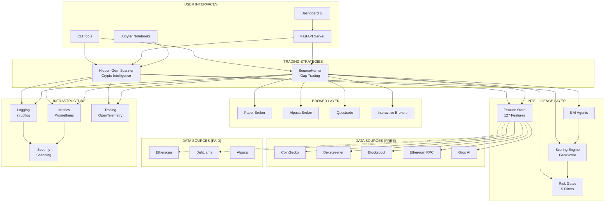
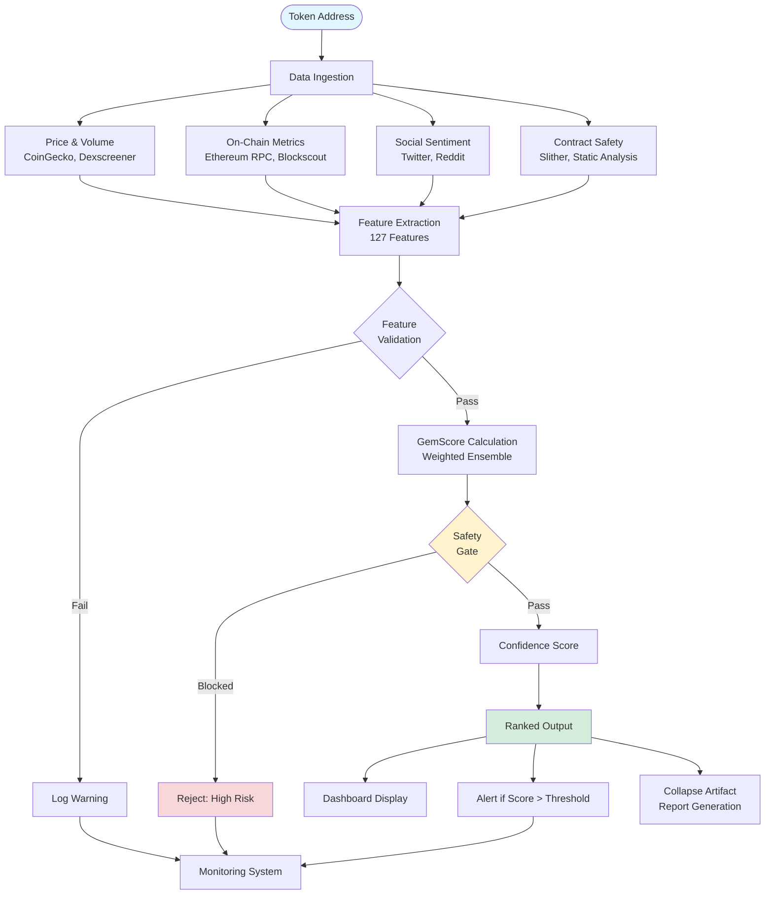
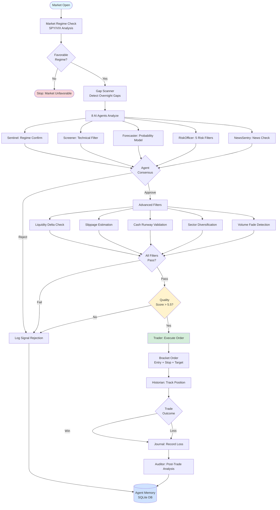
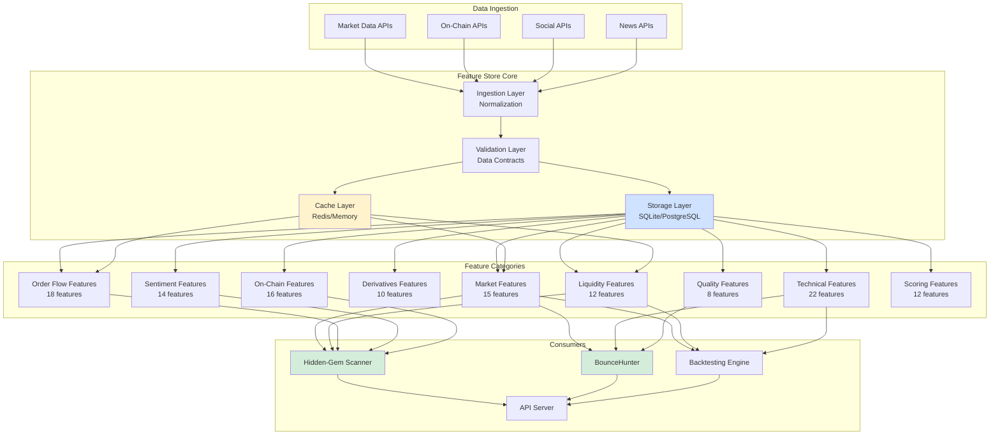
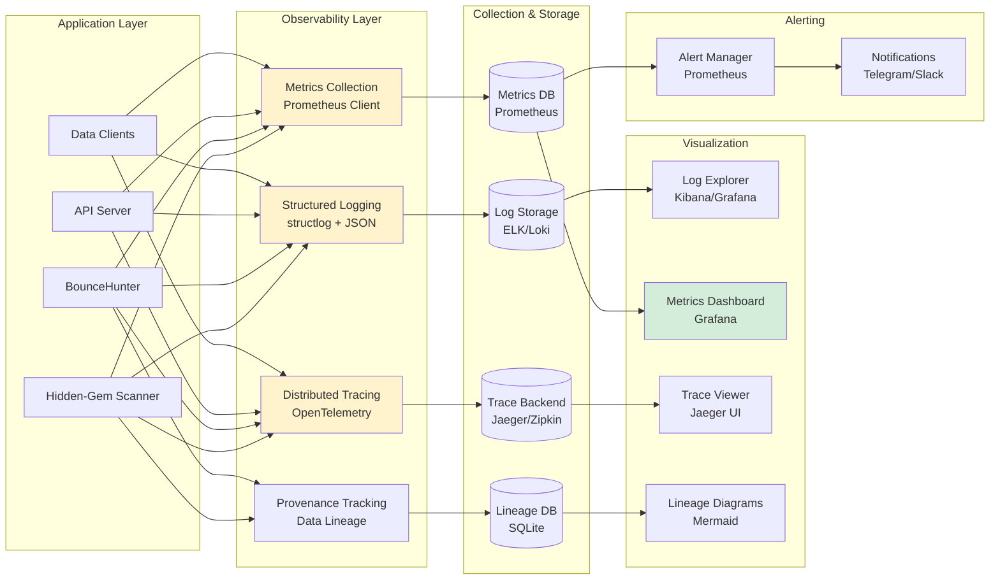
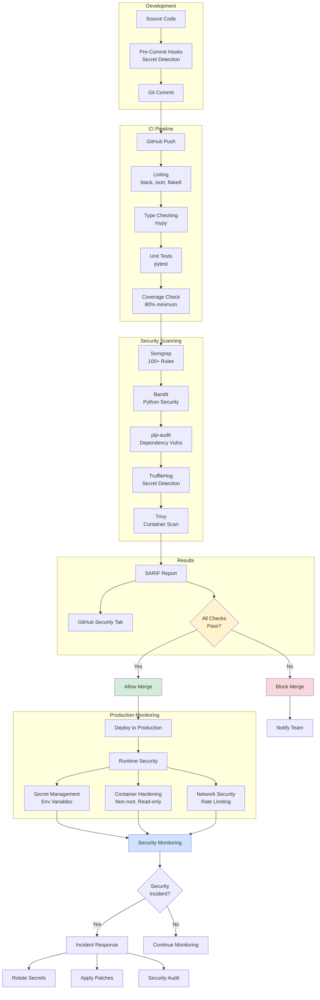
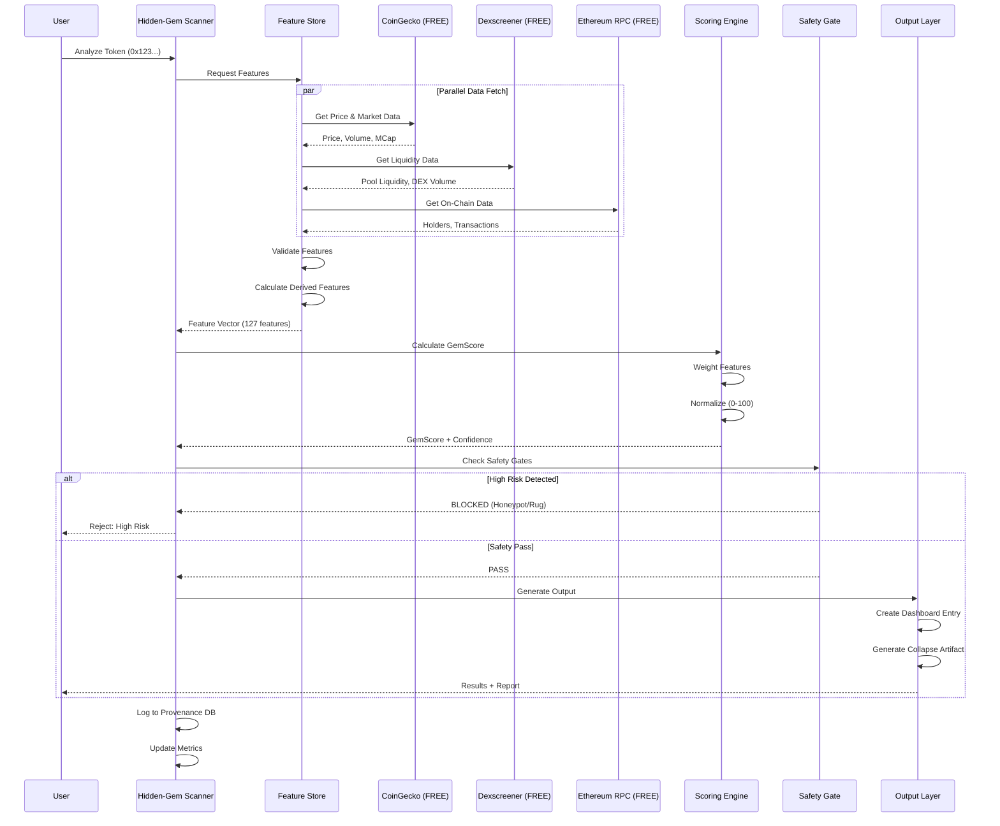
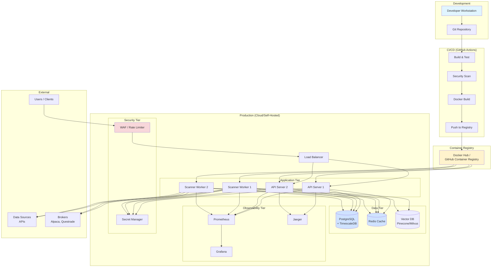

# AutoTrader System Diagrams

This document contains visual representations of the AutoTrader system architecture.

## System Overview

## Hidden-Gem Scanner Flow

## BounceHunter Trading Flow

## Feature Store Architecture

## Observability Stack

## Security Architecture

## Data Flow: Token Analysis

## Deployment Architecture

---

**Note**: These diagrams can be rendered using Mermaid-compatible tools like:
- GitHub Markdown (automatic rendering)
- Mermaid Live Editor (https://mermaid.live)
- VS Code with Mermaid extension
- MkDocs with Mermaid plugin
- Obsidian with Mermaid support

**Generated**: October 25, 2025
