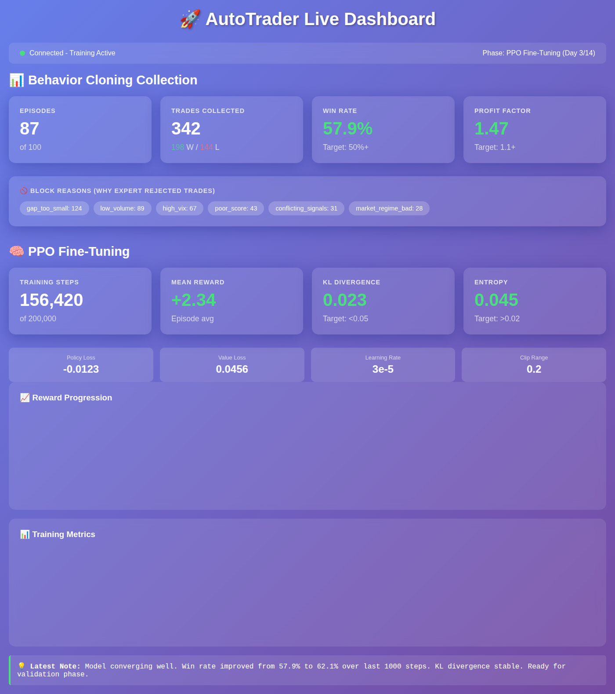

# AutoTrader Live Dashboard

Real-time web dashboard for monitoring BC collection and PPO training.



*Beautiful real-time visualization of training metrics with glassmorphism design.*

## Quick Start

1. **Install dependencies** (in venv_trading):
```powershell
pip install fastapi uvicorn
```

2. **Start the dashboard server**:
```powershell
cd C:\Users\kay\Documents\Projects\AutoTrader\Autotrader\autotrader_live_dashboard
..\venv_trading\Scripts\python.exe -m uvicorn dashboard_server:app --host 127.0.0.1 --port 8765
```

3. **Open in browser**:
```
http://127.0.0.1:8765/
```

4. **Run your training script** - it will auto-connect and push metrics

## Features

- **Live equity curve** with Chart.js
- **BC Collection stats**: episodes, trades, win rate, profit factor
- **Block reasons**: see why expert rejects trades (spread/cooldown/rsi/imbalance/time/stop)
- **PPO Training stats**: steps, reward, KL divergence, entropy, losses
- **WebSocket updates**: near-instant refresh, no polling
- **Auto-reconnect**: if dashboard restarts, training continues seamlessly

## Integration

Your training scripts (`train_bc.py`, `train_ppo_production.py`) have been instrumented with `MetricsClient`.

The dashboard updates automatically when training runs - no manual intervention needed!
